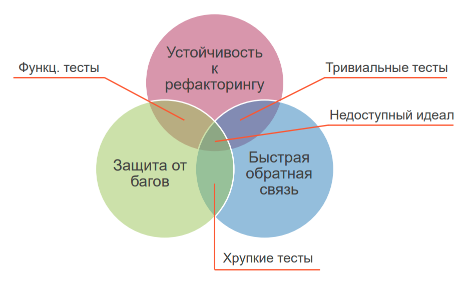
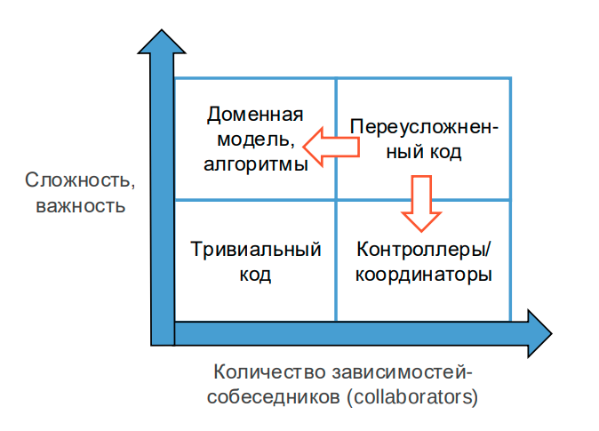
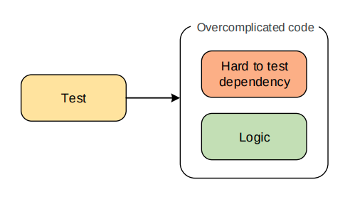
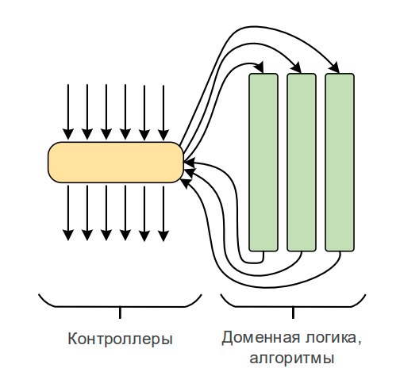
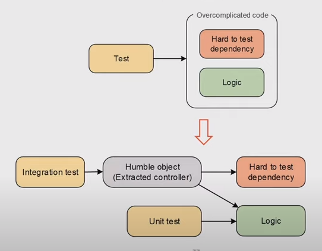
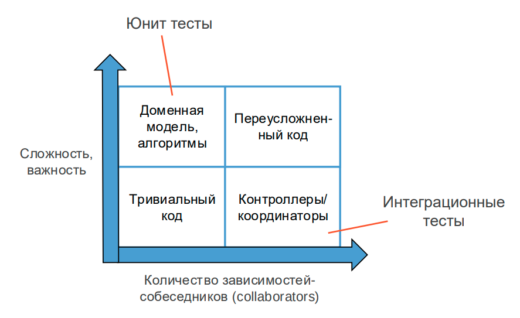
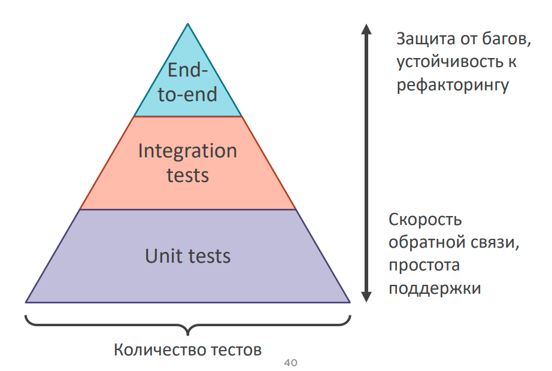

# Эффективность тестов:

## Критерии эффективности тестов:

-   **Защита от багов (Protection against bugs)**  
    Сколько ошибок способен выявить тест
-   **Скорость обратной связи (Fast Feedback)**  
    Стоимость устранения бага увеличивается в зависимости от этапа жизненного цикли проекта, на котором был обнаружен баг:  
    Development ➤ Quality Assurance (QA) ➤ Production
-   **Простота поддержки (Maintainability)**  
    – насколько сложно понять тест (размер и простота тестов)  
    – насколько сложно этот тест запускать (количество внешних зависимостей)
-   **Устойчивость к рефакторингу (Resilience to Refactoring)**  
    Качество кода снижается с течением времени, требуется рефакторинг.  
    Если после рефакторинга тесты выдают много ложных срабатываний, доверие к ним теряется.  
    Хрупкие тесты:  
    🚫 тесты деталей реализации (Structural inspection)  
    🚫 тесты исходного кода (Source code inspection)  
    Устойчивые тесты:  
    ✅ тесты конечных результатов, а не деталей реализации

`Точность теста = Сигнал (кол-во найденных багов) / Шум (кол-во ложных срабатываний)`  
`Сигнал` - критерий **Защита от багов**  
`Шум` - критерий **Устойчивость к рефакторингу**

**Ложные срабатывания** - подтверждение некорректности правильного кода.  
**Ложноотрицательные срабатывания** - подтверждение корректности не правильного кода

Сигнал/шум - децибеллы

## Диаграмма эффективности тестов

## Написание эффективных тестов

## Классификация кода

## Pattern "Humble Object"

  
  

Требования к тестам (Requirements):

-   Детерминизм/идемпотентность
-   Изоляция (независимость от внешних факторов)
-   Здравый смысл

Виды:

-   selectors-based
-   model testing
-   property-based testing  
    [How to get started with property-based testing in javascript using fast-check](https://jrsinclair.com/articles/2021/how-to-get-started-with-property-based-testing-in-javascript-with-fast-check/)  
    [How not to write property tests in javascript](https://jrsinclair.com/articles/2021/how-not-to-write-property-tests-in-javascript/)  
    [What is property based testing?](https://github.com/dubzzz/fast-check/blob/main/documentation/HandsOnPropertyBased.md)  
    [fast-check](https://github.com/dubzzz/fast-check)

# Виды тестирования

## Модульное тестирование (Unit Testing)

## Functional Testing

Testing the internal implementation of an object is always a bad idea. Do not test the implementation. Test the component from a user's perspective. In other words: test what the user should see.
A functional test, or End to End test is a way of testing web applications from the user's perspective.

## Visual Regression Testing (Screenshots Testing)

https://github.com/mojoaxel/awesome-regression-testing

-   [Loki](https://loki.js.org/)  
     
      
    Loki makes it easy to test your Storybook project for visual regressions.

    [Мастер-класс по тестированию фронтенда: тестирование вёрстки и функциональное тестирование](https://frontendconf.ru/moscow/2020/abstracts/7105)

-   [Creevey](https://github.com/wKich/creevey/)  
     
      
    Cross-browser screenshot testing tool for Storybook with fancy UI Runner.

    [Вжух! И скриншотные тесты заработали](https://frontendconf.ru/moscow/2021/abstracts/7436)

-   Hermiona

## Snapshot Testing

[React/react-test-renderer](https://reactjs.org/docs/test-renderer.html), \[[ru](<[react-test-renderer](https://ru.reactjs.org/docs/test-renderer.html)>)\]  
[Jest/Snapshot Testing](https://jestjs.io/docs/tutorial-react#snapshot-testing), \[[ru](https://jestjs.io/ru/docs/tutorial-react#snapshot-testing)\]

## integration testing

[Как находить больше багов с меньшими усилиями](https://frontendconf.ru/moscow/2020/abstracts/5991),
[jest-cucumber](https://www.npmjs.com/package/jest-cucumber)

e2e testing

-   cypress, puppeteer, webdriver

# Средства

## [jsdom](https://www.npmjs.com/package/jsdom)

Легковесная эмуляция браузера (его DOM и API), используется в качестве среды, замещающей браузер для рендеринга в нее компонент при проведении тестов.
Многие библиотеки тестирования предоставляют возможность, наряду с браузером, использовать jsdom в качестве среды рендеринга.

[Дмитрий Коваленко — Хватит использовать консоль для тестирования компонентов](https://www.youtube.com/watch?v=ROzqRsaL-yg)

-   Мы с вами привыкли к тому, что для тестирования фронтенда нужен jsdom. Jest стал неким стандартом тестирования UI-компонентов. Но хорошо ли то, что мы пытаемся тестировать UI в окружении Node.js?
-   почему jsdom — не ок и какие более надежные альтернативы jsdom можно придумать

## [Million](https://million.js.org/)

<1kb compiler-augmented virtual DOM. It's fast!

## [jest](https://jestjs.io/) from Facebook team

Среда выполнения тестов (test runner), интегрирован c jsdom

## [react-test-renderer](https://reactjs.org/docs/test-renderer.html) \[[ru](<[react-test-renderer](https://ru.reactjs.org/docs/test-renderer.html)>)\] from ReactJS team

Используется для unit- и snapshot-тестов react-компонент (тестирование "изнутри").

-   рендерер: `react-test-renderer.create`
-   среда: json object

Возможности:

-   производит рендеринг react-компонента в виде дерева json-объектов вида `{type, props, children}`, которые описывают react-компоненты (метод .toJSON())
-   дерево воспроизводит иерархию дочерних react-компонент, связанных через поля `parent, children`
-   предоставляет методы поиска компонент в дереве `findByType, findByProps`
-   предоставляет методы подстановки фиктивных ref-объектов

[Example test](./src/button/__tests__/button.snapshot-rtr.spec.tsx)
[Jest/Snapshot Testing](https://jestjs.io/docs/tutorial-react#snapshot-testing)
[Testing React Components with react-test-renderer, and the Act API](https://www.valentinog.com/blog/testing-react/)

## [ReactTestUtils](https://ru.reactjs.org/docs/test-utils.html) (react-dom/test-utils) from ReactJS team

Используется для создания юнит-тестов react-компонент.

-   рендерер: `ReactDom.render()`
-   среда: jsdom, browser

Возможности:

-   Simulate: эмуляция событий

???

[Example test](./src/button/__tests__/button.e2e-rtu.spec.tsx)

## [Testing Library](https://testing-library.com/docs/)

The [testing-library family of packages](https://www.npmjs.com/org/testing-library) helps you test UI components in a user-centric way.

Included:
[@testing-library/dom](https://testing-library.com/docs/dom-testing-library/intro),
[@testing-library/jest-dom](https://testing-library.com/docs/ecosystem-jest-dom),
[@testing-library/react](https://testing-library.com/docs/react-testing-library/intro/),
[@testing-library/react-hooks](https://react-hooks-testing-library.com/reference/api)

### [@testing-library/jest-dom](https://testing-library.com/docs/ecosystem-jest-dom),

  
is a companion library for Testing Library that provides custom DOM element matchers for Jest

### [@testing-library/user-event](https://testing-library.com/docs/ecosystem-user-event)

  
tries to simulate the real events that would happen in the browser as the user interacts with it. For example userEvent.click(checkbox) would change the state of the checkbox.

[Testing for Accessibility](https://testing-library.com/docs/dom-testing-library/api-accessibility/)

### [@testing-library/react](https://testing-library.com/docs/react-testing-library/intro/)

React Testing Library builds on top of DOM Testing Library by adding APIs for working with React components.
The React Testing Library is a very light-weight solution for testing React components. It provides light utility functions on top of react-dom and react-dom/test-utils
This library is a replacement for Enzyme.

[Example test](./src/button/__tests__/button.e2e-rtl.spec.tsx)  
[React Testing Library Tutorial](https://www.robinwieruch.de/react-testing-library/)  
[Testing for Accessibility](https://testing-library.com/docs/dom-testing-library/api-accessibility)

## [enzyme](https://enzymejs.github.io/enzyme/)

Библиотека хелперов для тестирования реакт-компонент "изнутри", их инфраструктуры
позволяет легко проверять, управлять, а также просматривать вывод React-компонентов

Enzyme is a JavaScript Testing utility for React that makes it easier to test your React Components' output. You can also manipulate, traverse, and in some ways simulate runtime given the output.
Enzyme's API is meant to be intuitive and flexible by mimicking jQuery's API for DOM manipulation and traversal.

Features:

-   [Shallow](https://enzymejs.github.io/enzyme/docs/api/shallow.html), [Full](https://enzymejs.github.io/enzyme/docs/api/mount.html), [Static](https://enzymejs.github.io/enzyme/docs/api/render.html) Rendering

[Testing React components with Jest and Enzyme](https://hackernoon.com/testing-react-components-with-jest-and-enzyme-41d592c174f), \[[ru](https://medium.com/@karafizi/%D1%82%D0%B5%D1%81%D1%82%D0%B8%D1%80%D0%BE%D0%B2%D0%B0%D0%BD%D0%B8%D0%B5-react-%D0%BA%D0%BE%D0%BC%D0%BF%D0%BE%D0%BD%D0%B5%D0%BD%D1%82%D0%BE%D0%B2-%D1%81-jest-%D0%B8-enzyme-%D0%BF%D0%B5%D1%80%D0%B5%D0%B2%D0%BE%D0%B4-985dcab18b7e)\]

## [react-is](https://www.npmjs.com/package/react-is) from ReactJS team

This package allows you to test arbitrary values and see if they're a particular React element type.

## axe

Библиотека хелперов для тестирования доступности

# Mock data library

## [jest](https://jestjs.io/ru/docs/jest-object)

-   Mock-функции:
    \[[1](https://jestjs.io/ru/docs/mock-function-api)\],
    \[[2](https://jestjs.io/ru/docs/jest-object#mock-%D1%84%D1%83%D0%BD%D0%BA%D1%86%D0%B8%D0%B8)\]
-   [Mock Модули](https://jestjs.io/ru/docs/jest-object#mock-%D0%BC%D0%BE%D0%B4%D1%83%D0%BB%D0%B8)
-   [Mock Timers](https://jestjs.io/ru/docs/jest-object#mock-timers)

## [sinon](https://sinonjs.org/)

Библиотека хелперов для создания моков

## [identity-obj-proxy](https://github.com/keyz/identity-obj-proxy)

Для моков CSS Modules

## [Mock Service Worker](https://mswjs.io/)

  
Mock Service Worker is an API mocking library that uses Service Worker API to intercept actual requests.

# Тестирование локализации

# Accessibility

## [Testing Library / Testing for Accessibility](https://testing-library.com/docs/dom-testing-library/api-accessibility)

## [jest-axe](https://www.npmjs.com/package/jest-axe)

  
Custom Jest matcher for axe for testing accessibility

# Тестирование RxJS

[RxJs testing patterns](https://medium.com/generic-ui/rxjs-testing-patterns-c2cbf207158b)

# Источники

[ReactJS/Основы тестирования](https://ru.reactjs.org/docs/testing.html)  
[ReactJS/Рецепты тестирования](https://ru.reactjs.org/docs/testing-recipes.html)  
[ReactJS/Среды тестирования](https://ru.reactjs.org/docs/testing-environments.html)  
[ReactJS/Утилиты для тестирования](https://ru.reactjs.org/docs/test-utils.html)  
[ReactJS/Тестовый рендерер](https://ru.reactjs.org/docs/test-renderer.html)
[Тестирование на примере ReactJS: насколько глубока кроличья нора](https://habr.com/ru/company/sberbank/blog/443316/)
[Владимир Хориков — Принципы юнит-тестирования](https://www.youtube.com/watch?v=LkrqqpkKIXE)
